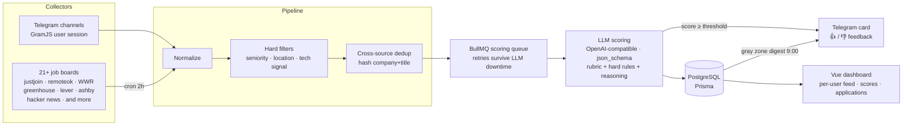

# Job Radar 📡

A personal job-vacancy radar: it collects openings 24/7 from Telegram channels and job
boards, scores each one against a candidate profile with an LLM, and delivers
high-signal matches as Telegram cards with one-tap feedback. A Vue dashboard tracks the
whole pipeline, per-user matches, and application status.

**Strategy: depth over volume.** High-quality matches only. No auto-apply, no spam.

> **Built with AI coding agents as the primary workflow**, not just autocomplete: a
> single orchestrator chat decomposed the multi-user rewrite into dependency-ordered
> tasks, ran them as parallel Claude Code sessions in isolated git worktrees, and
> gated every merge behind review + a green build/test/lint run. See
> [docs/ai-workflow.md](docs/ai-workflow.md) for the actual process, and
> [AGENTS.md](AGENTS.md) for the guidelines the agents worked under.

## Architecture



- **Backend** — NestJS 11, strict TypeScript. Modules: `collectors`, `pipeline`, `queue`,
  `scoring`, `telegram`, `tg-listener`, `auth`, `api`.
- **Queue** — BullMQ + Redis. Scoring jobs are idempotent, retry with capped exponential
  backoff for ~14h, and a backlog reconciler re-enqueues anything stale on boot and
  daily. The LLM being offline never loses a vacancy.
- **Scoring** — direct calls to any OpenAI-compatible endpoint (llama-server, vLLM) with
  `response_format: json_schema`. The prompt carries an explicit 0–100 rubric with hard
  rules; the schema forces intermediate verdicts (seniority match, location match,
  dealbreaker) before the final score, and a flagged dealbreaker caps the score in code.
- **Multi-user** — a shared vacancy pool is deduped once; scoring fans out per user,
  writing personal results to `UserMatch`. Every LLM call is logged (`LlmCall`) with
  tokens/latency/model so cheaper models can be routed to simple tasks (CV parsing,
  field extraction) while scoring keeps a stronger reasoning model.
- **Storage** — PostgreSQL via Prisma: vacancies, per-user matches, feedback, channels,
  application tracking.
- **UI** — Telegram bot (`/digest`, `/stats`, `/health`, `/channels`, forward-to-score) +
  a Vue 3 dashboard with a personal feed, pipeline/LLM/queue health, and application
  tracking.

## Quick start

```bash
docker compose up -d          # postgres + redis

npm install
cp backend/.env.example backend/.env   # fill in your tokens/keys
cd backend && npx prisma migrate deploy && cd ..
npm run build -w backend && node backend/dist/src/main.js
```

The dashboard lives in `client/` (`npm run dev -w client`, proxied to the API on `:3000`).

## Configuration

All settings via `backend/.env` — see [.env.example](backend/.env.example). Key knobs:

| Variable | Purpose |
|---|---|
| `LLM_BASE_URL` / `LLM_API_KEY` | Any OpenAI-compatible endpoint: local llama-server or a rented GPU pod |
| `LLM_MODEL_SCORE` / `LLM_MODEL_PARSE` / `LLM_MODEL_EXTRACT` | Per-task model overrides — route cheap tasks to cheap models |
| `LLM_THINKING` | Reasoning mode for scoring (default on) |
| `SCORING_THRESHOLD` | Notification cutoff (default 65) |
| `SCORING_CONCURRENCY` | 1 for a single-slot local server, 6–8 for a GPU pod |
| `TELEGRAM_*` | Bot token, whitelist chat id, GramJS user session |

## Quality loop

Hand-label ~50 vacancies on the dashboard's **Labeling** tab (yes / maybe / no,
keyboard-driven), then:

```bash
npm run golden:eval -w backend     # score the labeled set, report false alarms / misses per model
```

The model is recorded on every score, so different models/prompts can be compared on the
same golden set. 👍/👎 feedback from Telegram cards feeds the same loop.

## Where the project stands

The single-user pipeline (collection → filtering → dedup → LLM scoring → Telegram
delivery) is stable and has processed thousands of vacancies. Layered on top of it, the
multi-user rewrite currently ships:

- Multi-tenant data model (`User`, `UserProfile`, `UserMatch`) with per-user scoring
  fan-out
- Magic-link auth and a CV-parsing onboarding flow (LLM extracts tags, the user reviews
  them)
- A personal web feed scoped to the logged-in user
- Per-task LLM-call logging and model routing, feeding an analytics layer

Still in progress: linking a Telegram account to a web account, and an in-Telegram mini
app. See [docs/tech-spec.md](docs/tech-spec.md) for the full architecture.

## Docs

- [docs/tech-spec.md](docs/tech-spec.md) — architecture, data model, and how scoring
  fans out per user
- [docs/ai-workflow.md](docs/ai-workflow.md) — how this was built: parallel AI agent
  orchestration, task decomposition, review gates
- [docs/guide.md](docs/guide.md) — day-to-day usage guide + FAQ
- [docs/deploy.md](docs/deploy.md) — running it 24/7 (VPS or a local machine)
- [docs/runpod.md](docs/runpod.md) — renting a GPU for scoring (model/GPU picks, setup,
  cost math)
- [AGENTS.md](AGENTS.md) — the guidelines AI coding agents worked under throughout
  development

## License

MIT — see [LICENSE](LICENSE).
